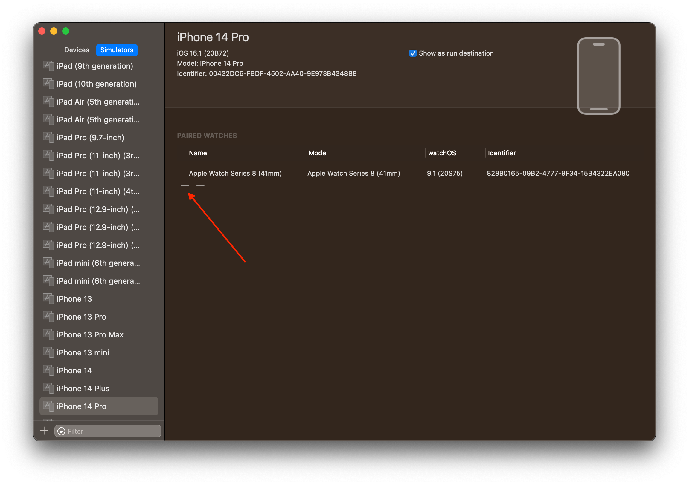

# watchOS

## Debug in simulator

In order to debug the watch app in the simulator please follow these steps: 

* Make sure you have an Apple Watch paired with your iPhone simulator 
* Run `SAPStart - iOS` scheme to update the iOS app installed on the simulator 
* Run `SAPStart - watchOS` scheme to update the watchOS app installed on the simulator

### Pair an Apple Watch with a simulator 

To pair an Apple Watch with a simulator, in Xcode go to `Window` -> `Devices and Simulators`. Then select the simulator you want to work on. Head over to the `Paired Watches` section and hit the "+" sign and add the desired watch model.

